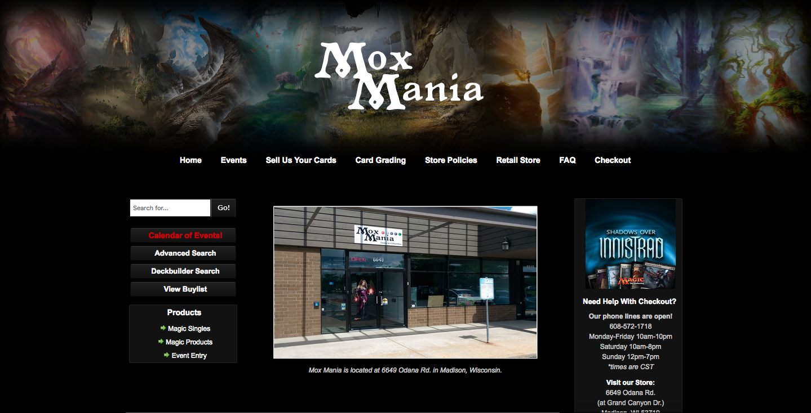

# MTGStorage

### Problem Statement

Since 1995, I have been playing Magic the Gathering, which is an ever expanding, multi-verse world, trading card game. Over the years, I have acquired tons of cards which are organized in a primitve way. Currently, there are numerous applications for mobile and desktop devices that can store your personal collection. Many of these are pay to use with outrageously high subscription rates based per card. For example, $4.99 to hold 100 cards. MTGStorage (name may change later) will be my solution to oraginzing and managing my collection, that can be accessed online at my leisure. Through this application, I will be able to search, add, and remove cards when needed. A card search feature will be accessible to search any card that has been in print since it's creation. I will be able to do advanced queries on my cards such as mana cost, power or toughness of a creature, type of creature, and much more, instead of just searching by name of a card. Users will be able to sign up/in to accesss the features. This will be largely for personal use, which includes close friends.

Moxmania.com is an Magic the Gathering (MTG) commerce site where you can search cards and add them to your cart and you can buy them over the internet or in store, located on Odana Rd in Madison WI, pending you are a subscriber to their services. Though my application is not an e-commerce site, I admire the card searching feature, format of a card query search, and the basic web layout.

[Moxmania.com home screen](images/moxmania.png)

[Screen Desgin](DesignDocuments/screens.md)
